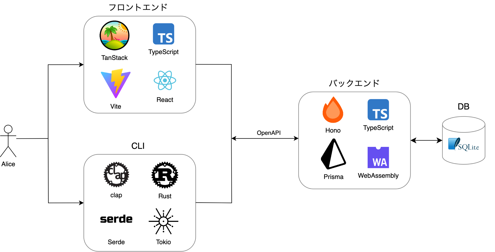

# Architecture

## Overview

プロジェクトの俯瞰図は次のようになります。

## Directory Structure

| Directory                   | Description                                |
| --------------------------- | ------------------------------------------ |
| [`frontend`](./frontend/)   | フロントエンド                             |
| [`backend`](./backend/)     | バックエンド                               |
| [`cli`](./cli/)             | CLI                                       |
| [`generated`](./generated/) | ソースコードから自動生成されたファイルたち |

コマンド等はそれぞれのディレクトリ内の`README.md`を参照してください。

### Frontend

Frontendのアーキテクチャについては、[frontend/ARCHITECTURE.md](./frontend/ARCHITECTURE.md) を参照してください。

### Backend

Backendのアーキテクチャについては、[backend/ARCHITECTURE.md](./backend/ARCHITECTURE.md) を参照してください。

### CLI

CLIのアーキテクチャについては、[cli/ARCHITECTURE.md](./cli/ARCHITECTURE.md) を参照してください。
