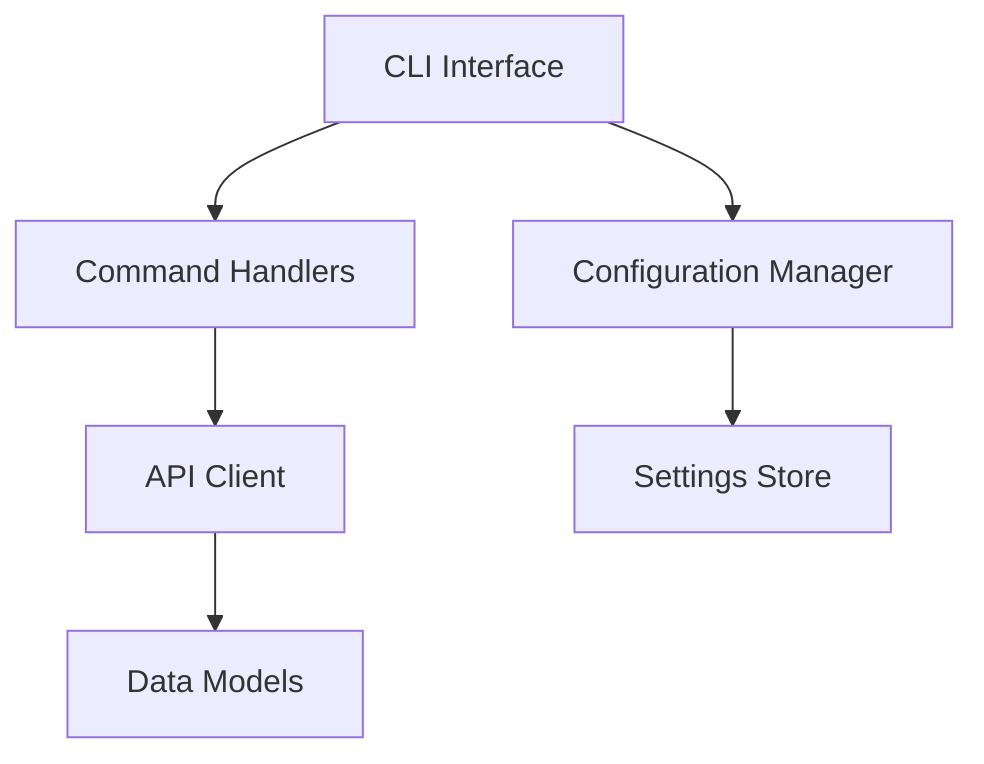

# Shuiro CLI Design Document

## Overview

shuiro-cliは、プログラミング問題の提出・評価システムのためのCLIツールです。REST APIと連携して、問題の閲覧、解答の提出、結果の確認を行うことができます。

## Goals

- シンプルで使いやすいコマンドラインインターフェース
- 堅牢なエラーハンドリング
- 詳細なデバッグ情報の提供
- クロスプラットフォーム対応
- 拡張性のある設計

## Non-Goals

- GUIインターフェース
- 問題の作成・編集機能
- ユーザー管理機能
- オフラインでの問題解決

## Architecture

### Core Components



### Directory Structure

```
shuiro/
├── Cargo.toml
└── src/
    ├── main.rs          # エントリーポイント
    ├── commands/        # コマンドハンドラー
    │   ├── mod.rs
    │   ├── config.rs    # 設定管理
    │   ├── list.rs      # 問題一覧
    │   ├── show.rs      # 問題詳細
    │   └── submit.rs    # 解答提出
    ├── models/          # データモデル
    │   ├── mod.rs
    │   ├── problem.rs   # 問題関連
    │   └── submission.rs # 提出関連
    ├── config/          # 設定管理
    │   ├── mod.rs
    │   └── settings.rs
    └── api/             # API通信
        ├── mod.rs
        └── client.rs
```

## Command Line Interface

### Global Options

- `RUST_LOG`: ログレベルの設定（debug, info, warn, error）
- `SHUIRO_DEBUG`: デバッグモードの有効化

### Commands

1. 設定管理

```bash
shuiro config --api <URL>    # APIエンドポイントの設定
shuiro config --show         # 現在の設定を表示
```

2. 問題管理

```bash
shuiro list                  # 問題一覧の表示
shuiro show <id>            # 問題詳細の表示
```

3. 解答提出

```bash
shuiro submit <id> <file> <language> <version>
```

## Data Models

### Problem

```rust
pub struct Problem {
    pub id: i32,
    pub title: String,
    pub body: String,
    pub supported_languages: Vec<Language>,
    pub test_cases: Vec<TestCase>,
}
```

### Submission

```rust
pub struct SubmissionResponse {
    pub id: i32,
    pub code: String,
    pub language_name: String,
    pub language_version: String,
    pub result: SubmissionResult,
    pub test_results: Vec<TestResult>,
}
```

## Error Handling

### Error Types

1. API関連エラー
   - HTTPエラー
   - リソース未検出
   - 不正なリクエスト
   - サーバーエラー

2. クライアントエラー
   - 設定エラー
   - ファイル読み込みエラー
   - バリデーションエラー

### Error Display

- 色付きの出力（red, green）
- エラーメッセージの階層表示
- デバッグ情報の条件付き表示

## Configuration

### 設定ファイル位置

- Linux: `~/.config/shuiro/config.toml`
- macOS: `~/Library/Application Support/com.shuiro.shuiro/config.toml`
- Windows: `%APPDATA%\shuiro\shuiro\config.toml`

### 設定項目

```toml
api_endpoint = "http://localhost:3000/api"
```

## Security Considerations

1. API通信
   - HTTPS通信のサポート
   - 適切なヘッダー設定
   - エラーメッセージでの機密情報の除外

2. ファイル操作
   - パスのバリデーション
   - 適切なパーミッションチェック

## Performance

### 最適化戦略

1. リリースビルドの最適化

   ```toml
   [profile.release]
   opt-level = 3
   lto = true
   codegen-units = 1
   panic = 'abort'
   strip = true
   ```

2. リクエストの最適化
   - 適切なHTTPヘッダーの設定
   - レスポンスのストリーミング
   - 不要なデータの削除

## Future Improvements

1. 機能追加
   - テストの事前実行機能
   - 提出履歴の表示
   - バッチ提出の対応
   - タブ補完の実装

2. 改善点
   - キャッシュ機能の実装
   - インタラクティブモードの追加
   - 進捗表示の改善
   - より詳細なエラーメッセージ

3. 技術的な改善
   - 非同期処理の最適化
   - メモリ使用量の削減
   - エラーハンドリングの強化
   - ログ出力の改善

## References

1. APIドキュメント
   - OpenAPI仕様: `/api/openapi.json`
   - APIリファレンス: `/api/docs`

2. 使用ライブラリ
   - clap: コマンドライン引数のパース
   - reqwest: HTTP通信
   - serde: シリアライズ/デシリアライズ
   - colored: 色付き出力
   - tokio: 非同期ランタイム

3. 設計パターン
   - コマンドパターン（コマンド処理）
   - ビルダーパターン（APIクライアント）
   - ファサードパターン（設定管理）
